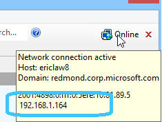
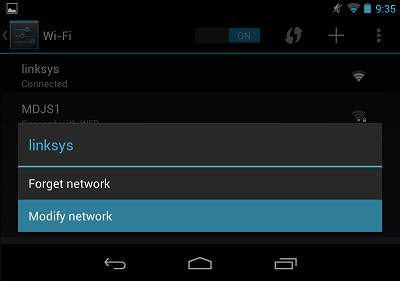
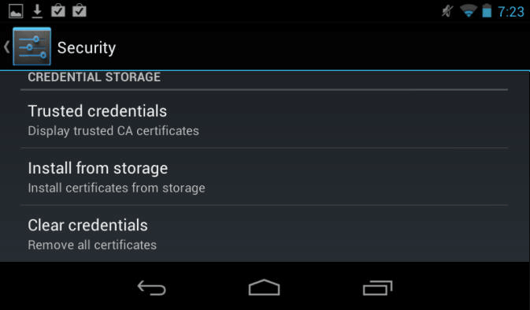

<!-- http://fiddler2.com/Fiddler/help/AndroidNexus7.asp -->

#Configuring Android / Google Nexus 7

##Get Traffic to Fiddler
Fiddler runs as a proxy on port 8888 on your Windows PC; you can easily proxy traffic from your Google Nexus device through Fiddler to debug it.

Note: The "Device Debugging" topic is covered in greater depth in the [Fiddler Book.](http://fiddlerbook.com/)

1. In Fiddler, click **Tools / Fiddler Options / Connections** and ensure that the box **Allow remote computers to connect** is checked. (Restart Fiddler if this box wasn't already checked.)

2. Note the IP Address of the Fiddler PC; you can see this by hovering over the icon in the toolbar:  

3. On the Nexus, swipe down from the top and push the **Settings** icon. Click the **Wi-Fi** entry and select your current Wi-Fi network.

4. Tap and hold and choose **Modify Network**  

5. Check the **Show advanced options** box.  

6. Choose **Manual** from the **Proxy settings** dropdown.

7. Fill in the IP Address and port (**8888**) of the PC running Fiddler.  

8. Tap **Save** to save the change.

9. In Chrome, visit **http://ipv4.fiddler:8888/** and ensure that you see the traffic in Fiddler, and that Chrome shows the **Fiddler Echo Service** webpage.  
After you complete your tests, return to the Proxy Settings screen and remove the proxy.  
Note: Some Android applications may not respect the system's proxy setting.

##Decrypt HTTPS
After you have basic proxying working, the next step is to get HTTPS decryption working.

1. On the Fiddler Echo Service Webpage, click the **FiddlerRoot Certificate** link at the bottom. Or, tap and hold and choose **Open in new tab.**  

2. If the download doesn't open automatically, swipe down from the top and click the **Settings** icon.

3. Click **Personal > Security.** In the **Credential storage** section, click **Install from storage.** Pick the **FiddlerRoot.cer** file. Type a name for the certificate if you'd like.  

4. After installing the certificate, you can click the **Trusted credentials** item and then click **User** to see the Fiddler certificate. After you have completed your testing, you can delete the certificate here.  

Note: On some Android Devices, you may need to use the [Certificate Maker plugin](http://www.fiddler2.com/Fiddler/help/httpsdecryption.asp#ios) to generate certificates.

Note: Some websites (e.g. Google.com) use a technique called "Certificate Pinning" and may not work with Fiddler's certificates.