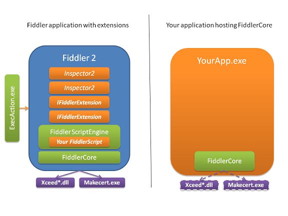

<!-- http://fiddler2.com/Fiddler/Core/ -->

#Introducing FiddlerCore

*FiddlerCore* allows you to integrate HTTP/HTTPS traffic viewing and modification capabilities into your .NET application, without any of the Fiddler UI. 

Learn how to develop with FiddlerCore by reading [the Wiki](http://fiddler.wikidot.com/fiddlercore). The install package contains a **.NET 2.0** and a **.NET 4.0** version of the FiddlerCore assembly.

FiddlerCore (v2.4.0.1) can be [downloaded here](http://fiddler2.com/redir/?id=FiddlerCoreBits).
Documentation can be [downloaded here](http://fiddler2.com/dl/FiddlerCoreDocsSetup.exe).

**THE SOFTWARE IS LICENSED "AS-IS." YOU BEAR ANY AND ALL RISK OF USING IT.**

Full license terms are contained in the file License.txt in the package. 

Please submit any feedback about FiddlerCore using the "Contact" link above.

##Extension Modules
Currently, FiddlerCore cannot host extensions (e.g. Import/Export Transcoders, or the iOS Certificate Maker) which are compiled targeting Fiddler. That's because the classes in FiddlerCore live in FiddlerCore.dll instead of Fiddler.exe. It's possible that .NET [type forwarding](http://msdn.microsoft.com/en-us/library/ms404275.aspx) might help, but this is not something we have attempted. 

In the future, if there's interest, the aforementioned extensions may be made available for use in FiddlerCore. Please contact us with this request if it is something you need. Thanks!
