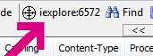
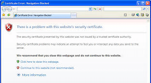
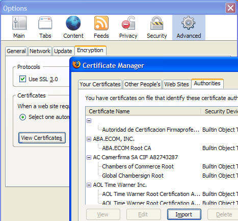

<!-- http://fiddler2.com/fiddler/help/faq.asp -->

#Frequently Asked Questions

 

NEW The [HowTo guide](http://fiddler2.com/fiddler/help/howto.asp) explains how to accomplish a variety of tasks with Fiddler.

 

**Q:** Why can't I see the HTTPS traffic-- I only see a "CONNECT" tunnel?  
**A:** HTTPS Traffic decryption is disabled by default. Learn more about [decrypting HTTPS traffic with Fiddler2.](http://fiddler2.com/fiddler/help/httpsdecryption.asp)

 

**Q:** Why don't I see any traffic?  

Are you using Trend Micro security software? The Trend Micro Proxy Service continually rewrites your system proxy settings, which breaks Fiddler's ability to see your traffic. To use Fiddler, you will need to disable that feature. In the Windows Services control panel, it's called Tmproxy, "OfficeScan NT Proxy Service", and the Description is "Scans network traffic before passing it to the target application."

If you are not using Trend Micro, keep reading...

Try using your browser to visit [http://localhost.fiddler:8888/](http://localhost.fiddler:8888/) and determine what you see in the browser and in Fiddler (remember these facts and share them if you want to discuss your issue in the forum or using the Help link).

Then, keep reading...

**Q:** I see some traffic, but some traffic (e.g. from a specific program) seems to be missing?
Do you have any Traffic Filters enabled?  Check in the **status bar**, the **Process Filter** in the toolbar, and the **Filters tab**. If you've written or set any Rules (see the menu) check those too.

   

In Fiddler v2.3.6.3 and later, you can click **Troubleshoot Filters...** on the Help menu. When you do so, traffic that would otherwise be hidden is instead shown in a strikethrough font. The **Comments** column will show which of Fiddler's filters was responsible for attempting to hide the traffic.

**Q:** Does Fiddler2 support sites that require client certificates?  
**A:** Yes, Fiddler 2.1.0.3 and later support client certificates.  See [Attaching Client Certificates](http://fiddler2.com/fiddler/help/httpsclientcerts.asp) for more information.

**Q:** Is Fiddler2 the only tool that debugs HTTPS traffic?  
**A:** No.  There are a number of other free tools which offer this capability, including the Charles and Burp proxies, written with Java.

**Q:** The HTTPS protocol was designed to prevent traffic viewing and tampering.  Given that, how can Fiddler2 debug HTTPS traffic?  
**A:** Fiddler2 relies on a "man-in-the-middle" approach to HTTPS interception.  To your web browser, Fiddler2 claims to be the secure web server, and to the web server, Fiddler2 mimics the web browser.  In order to pretend to be the web server, Fiddler2 dynamically generates a HTTPS certificate. 

Fiddler's certificate is not trusted by your web browser (since Fiddler is not a Trusted Root Certification authority), and hence while Fiddler2 is intercepting your traffic, you'll see a HTTPS error message in your browser, like so:

**Q:** Can I reconfigure my Windows client to trust the bogus root to avoid error messages and enable logon to services like Passport?  
**A:** Yes, although this is not a recommended configuration.  You should never make this configuration change on a non-Test machine.

1. Visit a HTTPS site with Fiddler2 running, ensure that you see the Certificate Error warning page
2. START > RUN > CERTMGR.MSC
3. Drag the DO_NOT_TRUST_FiddlerRoot certificate to the Trusted Root Certification Authorities folder  

You can make a similar configuration change for Firefox and other clients that do not use the Windows Certificate store; use the appropriate Options dialog in the browser.  

**Q:** Does Fiddler2 demonstrate a flaw in HTTPS?  
**A:** No.  HTTPS relies on certificates in order to secure web traffic.  Web browsers prevent man-in-the-middle attacks by relying upon Trusted Root Certification authorities to issue certificates that secure the traffic.  As designed, web browsers will show a warning when traffic is not protected by a certificate issued by a trusted root.

**Q:** Can I change the Text Editor used by Fiddler to something other than Notepad?  
**A:** Yes. 

* Close Fiddler.
* Run RegEdit
* Navigate to HKCU\Software\Microsoft\Fiddler2
* Add a new REG_SZ named **TextEditor**
* Set the new registry value to the path to your text editor.

**Q:** Can I change the file comparison tool used by Fiddler to something other than WinDiff?  
**A:** [Yes.](http://fiddler2.com/fiddler/help/CompareTool.asp) 

**Q:** I like to navigate around a site then do a "search" for a text on all the logged request/responses. I was curious if Fiddler automatically decompressed gzipped responses during search?  
**A:** Fiddler does not decompress during searches by default, since it would need to keep both the compressed and decompressed body in memory (for data integrity reasons).

In current versions of Fiddler, you can tick the "Decode Compressed Content" checkbox on the Find dialog.
**Q:** The HTTPS protocol was designed to prevent traffic viewing and tampering.  Given that, how can Fiddler2 debug HTTPS traffic?  
**A:** Please see the topic [Decrypting HTTPS traffic with Fiddler2.](http://fiddler2.com/fiddler/help/httpsdecryption.asp)

**Q:** I have another problem.  
**A:** Check the [Known Issues](http://fiddler2.com/fiddler/help/knownissues.asp) or [ask in the community!](http://fiddler2.com/redir/?id=fiddlerdisc)