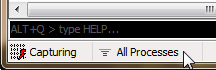
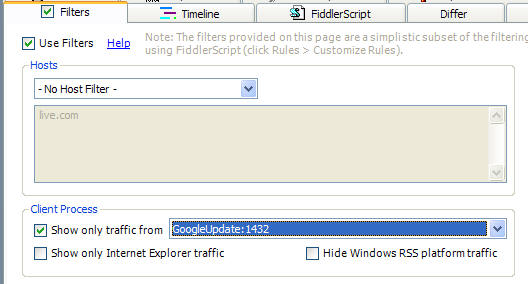

Problem
-------

I see some traffic, but some traffic (e.g. from a specific program) seems to be missing

Solution
--------

Do you have any Traffic Filters enabled?  Check in the **status bar**, the **Process Filter** in the toolbar, and the **Filters tab**. If you've written or set any Rules (see the menu) check those too.

   

In Fiddler v2.3.6.3 and later, you can click **Troubleshoot Filters...** on the Help menu. When you do so, traffic that would otherwise be hidden is instead shown in a strikethrough font. The **Comments** column will show which of Fiddler's filters was responsible for attempting to hide the traffic.
