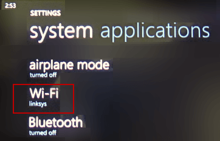
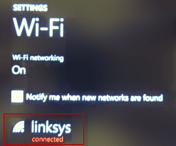
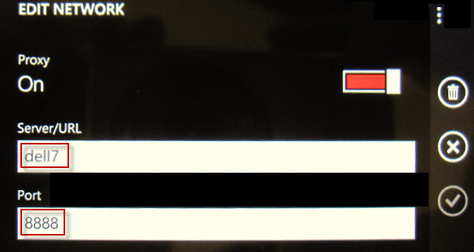
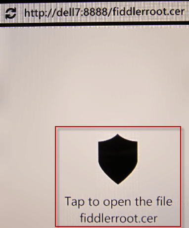
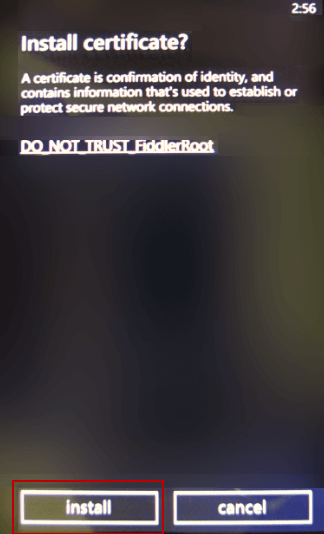

# Monitor Windows Phone

## Configure Fiddler

1. Start Fiddler Classic on the Fiddler server (the machine that will capture the traffic).
2. Click **Tools > Options**. Click **Allow remote clients to connect**. 
 
3. Restart Fiddler.
4. In the Windows Security Alert dialog, check all three checkboxes and click the **Allow Access** button.
 

To verify this configuration, enable your Windows Phone WiFi connection and visit **http://FIDDLERSERVER:8888**, where FIDDLERSERVER is the machine name for the machine running Fiddler. This should display the **Fiddler Echo Service** web site.

## Configure Windows Phone

1. Tap **Settings > WiFi**.
 
2. Tap the active WiFi connection.
 
3. Slide the **Proxy Slider** to **On**.
4. In the **Server/URL** field, type the machine name for the Fiddler server.
5. In the **Port** field, type **8888**.
 
6. Tap the checkmark icon.

## Decrypt HTTPS Traffic

1. [Configure Fiddler Classic to decrypt HTTPS traffic](slug://DecryptHTTPS).
2. On the Windows Phone, use Mobile IE to request an HTTPS protocol URL.
3. Go to `http://FIDDLERSERVER:8888/FiddlerRoot.cer`.
4. Tap the icon labeled **Tap to open the file fiddlerroot.cer**.
 
5. Tap **install**.
 

Note: There is no known resource containing steps to remove security certificates from a Windows Phone. This may prevent connecting to a different Fiddler proxy, which will use a different security certificate.

## Disable Monitoring

After Fiddler Classic monitoring is complete:

1. Tap **Settings > WiFi**.
2. Tap the active WiFi connection.
3. Slide the **Proxy Slider** to **Off**.

## See Also

[No Windows Phone 7 traffic](slug://NoWindowsPhone7Traffic)

