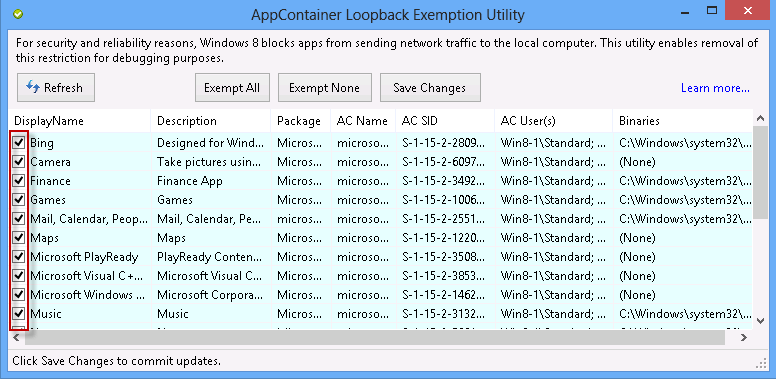
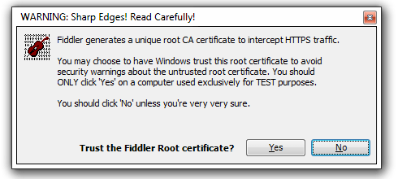
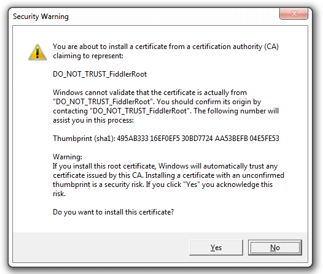
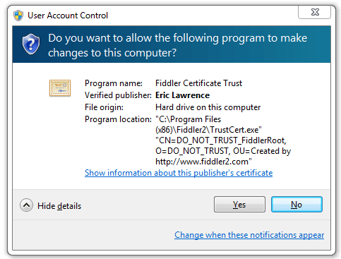
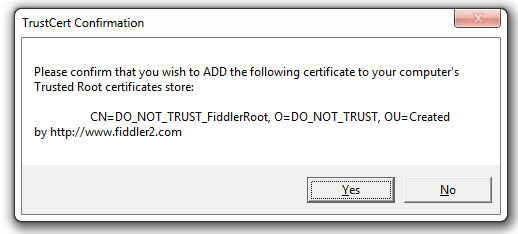

<!-- http://fiddler2.com/Fiddler/help/AndroidNexus7.asp -->

# Configure Fiddler Classic for Windows 8 Metro-style applications

Follow two steps to configure Fiddler Classic for Windows 8:

+ Create a Loopback Exemption
+ Place Fiddler Root Certificate in the Machine's Trusted Root Store

Create a Loopback Exemption
---------------------------

1.	(Fiddler2 Only:) Install and launch the [EnableLoopback Utility](https://www.telerik.com/fiddler/add-ons) by clicking the **Win8 Config** button.

      

2.    Check the box next to each application that will send traffic to Fiddler Classic.  This requires Administrator privileges.

      

Now these applications can send traffic to Fiddler Classic.

* To allow Unit Tests in Visual Studio 2012 to send traffic to Fiddler Classic, click the AppContainer Loopback Exemption Utility Refresh button while the Unit Test is running. An AppContainer for the Unit Test will appear. Check the box for this AppContainer. [Learn more](https://stackoverflow.com/questions/13360309/using-fiddler-with-windows-store-unit-test).

* An alternative to using the AppContainer Loopback Exemption Utility is to [declare the privateNetworkClientServer permission](https://msdn.microsoft.com/en-us/library/windows/apps/br211380).

Place Fiddler Root Certificate in the machine's Trusted Root store
--------------------------------------------------------------------

1.	Enable Fiddler Classic HTTPS-decryption feature. A **Warning** dialog appears. Click **Yes** to trust the Fiddler Root certificate.

 

2.	A Security Warning dialog appears. Click **Yes** to install the Fiddler Root certificate.

 

3.	The User Account Control dialog appears. Click **Yes** to place the Fiddler Root Certificate into the machine-wide Trusted Root Certification Authorities store.

 

4.	The TrustCert Confirmation dialog appears. Click **Yes**.

 