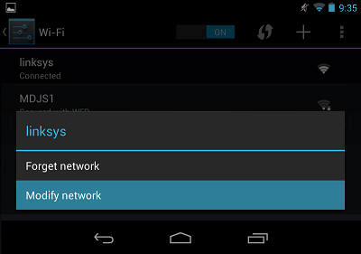
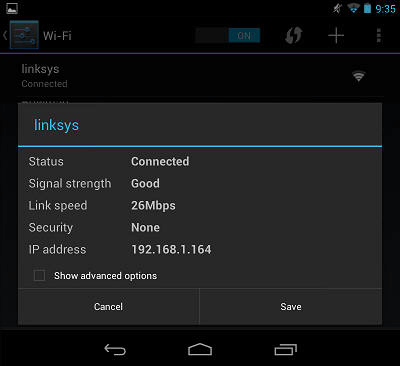
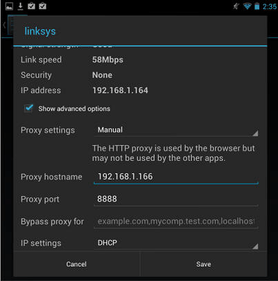
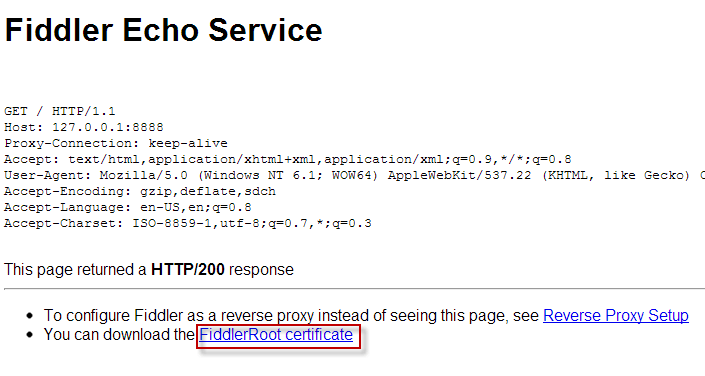
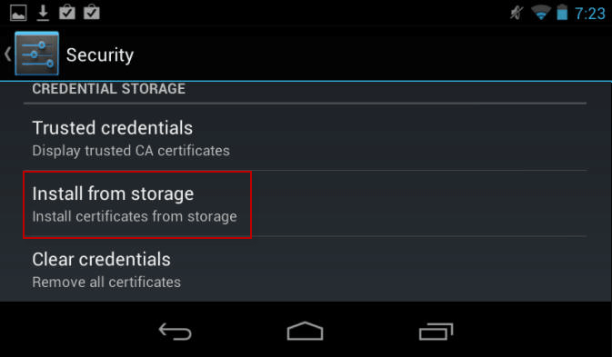

# Configure Fiddler Classic for Android Devices

>tip Update: If you're looking for Fiddler for Android, check out the new [Fiddler Everywhere](https://www.telerik.com/fiddler/fiddler-everywhere)! Check this [blog post](https://www.telerik.com/blogs/new-release-fiddler-everywhere-3) to learn more about it or directly see how easy it is to [setup and use Fiddler Everywhere alongside Android device](https://docs.telerik.com/fiddler-everywhere/traffic/configure-android).

## Configure Fiddler Classic

1. Click **Tools > Fiddler Options > Connections**.

1. Ensure that the checkbox by **Allow remote computers to connect** is checked. 

1. If you check the box, restart Fiddler.

1. Hover over the **Online indicator** at the far right of the Fiddler toolbar to display the IP address of the Fiddler server.

 

1. Ensure that you have installed and using **BouncyCastle** as a certificate generator. Newer versions of Android will reject certificates with more than two years of validity, and currently, only the BouncyCastle generator will output a compatible certificate for Android devices. [Learn more about certificate generators and how to install and enable BouncyCastle here...](https://www.telerik.com/blogs/understanding-fiddler-certificate-generators).

## Configure Android Device

1. Swipe down from the top of the screen and tap the **Settings** icon.

1. Tap **Wi-Fi**.

1. Tap and hold your current Wi-Fi network. Select **Modify Network**.

 

1. Tap the **Show advanced options** box.

 

1. Tap the **Proxy settings** dropdown and select **Manual**.

 

1. Type the IP address and port (usually 8888) of the Fiddler server.

 

1. Tap **Save**.

To verify this configuration, go to **http://ipv4.fiddler:8888/**. Chrome should display the **Fiddler Echo Service** webpage, and the traffic should appear in Fiddler.

## Disable the proxy

After using Fiddler, return to the **Proxy Settings** screen above and remove the proxy.

## Decrypt HTTPS

1. On the **Fiddler Echo Service Webpage**, click the **FiddlerRoot Certificate** link.

 

 >important Ensure that the Fiddler certificate is generated through the BouncyCastle certificate generator.

1. If the download doesn't open automatically, swipe down from the top and tap the **Settings** icon.

1. Tap **Personal > Security.** 

1. Under **Credential Storage**, tap **Install from storage**. 

 

5. Tap the **FiddlerRoot.cer** file. 

6. (Optional) Type a name for the certificate.

To verify this configuration, tap **Trusted credentials > User**. This should display the Fiddler certificate.

## Disable HTTPS Decryption

To delete the FiddlerRoot certificate, tap **Trusted credentials > User** and delete the certificate.