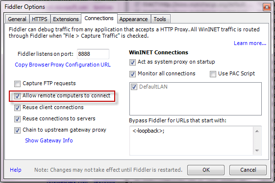
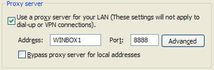

# Capture Traffic from Another Machine (Any OS)

## Set Remote Machine Proxy Settings

1. Start Fiddler Classic on the Fiddler server (the machine that will capture the traffic).

2. Click **Tools > Options**. Ensure **Allow remote clients to connect** is checked.

 

3. On the other machine, set the proxy settings to the machine name of the Fiddler server at port 8888.

 

## Decrypt HTTPS traffic from the Remote Machine

Configure the remote machine to [trust the FiddlerRoot certificate](slug://TrustFiddlerRootCert)