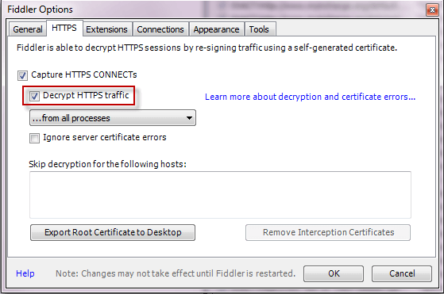
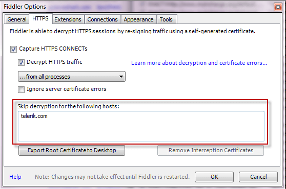

# Decrypt HTTPS Traffic

>tip If you need a cross-platform HTTPS capturing and decrypting tool, try the new [Fiddler Everywhere](https://www.telerik.com/fiddler/fiddler-everywhere). Read the [Fiddler Everywhere 3 blog post](https://www.telerik.com/blogs/new-release-fiddler-everywhere-3) for more details, or learn how to [capture](https://docs.telerik.com/fiddler-everywhere/traffic/capture-traffic) and [inspect](https://docs.telerik.com/fiddler-everywhere/traffic/inspect-traffic) HTTPS traffic with Fiddler Everywhere.

By default, Fiddler Classic does not capture and decrypt secure HTTPS traffic. To capture data sent through HTTPS, enable HTTPS traffic decryption.

## Enable HTTPS Traffic Decryption

1. Click **Tools** > **Options** > **HTTPS**.
2. Click the **Decrypt HTTPS Traffic** box.
 

## Skip Traffic Decryption for a Specific Host

1. Click **Tools** > **Options** > **HTTPS**.
2. Type the hostname in the **Skip Decryption** field.
 

## Skip Traffic Decryption for an Application

To skip traffic decryption for a specific application or to decrypt HTTPS traffic only from a single host, modify the `OnBeforeRequest` function in [FiddlerScript](https://www.telerik.com/blogs/understanding-fiddlerscript).

Add a rule like the following inside the [`OnBeforeRequest` function](https://docs.telerik.com/fiddler/knowledge-base/fiddlerscript/modifyrequestorresponse):

```C#
if (oSession.HTTPMethodIs("CONNECT") && oSession["X-PROCESSINFO"] && oSession["X-PROCESSINFO"].StartsWith("outlook")) 
{ 
	oSession["x-no-decrypt"] = "boring process";
}    
```  

## Decrypt Traffic from One Hostname Only

Add a rule like the following inside the [`OnBeforeRequest` function](https://docs.telerik.com/fiddler/knowledge-base/fiddlerscript/modifyrequestorresponse):

```c#
if (oSession.HTTPMethodIs("CONNECT") && 
	!oSession.HostnameIs("SiteICareAbout.com"))
{ 
	oSession["x-no-decrypt"] = "do not care."; 
}
```

## See Also

[Responding to requests with client certificates](slug://RespondWithClientCert)

