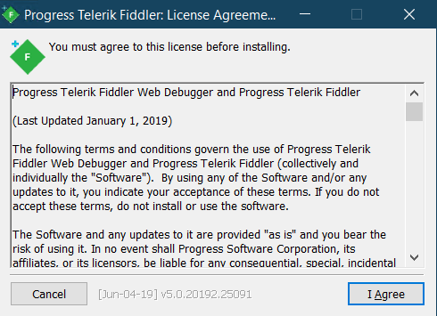
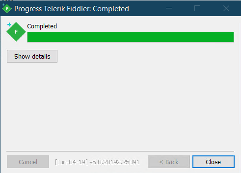

# Using Fiddler 

- Download the Fiddler product:
    * Download the latest version of [Fiddler Classic (Windows only)](https://www.telerik.com/download/fiddler).
    * Download the latest version of [Fiddler Everywhere supported on Windows, macOS, and Linux](https://www.telerik.com/download/fiddler-everywhere)
- Install **Fiddler Classic**
    - Select **Run** from any Security Warning dialog.
        
    - Agree to the License Agreement.
        
    - Select the install directory for Fiddler.
        
    - Click **Close** when installation completes.
        
- Install **Fiddler Everywhere**
    - Fiddler Everywhere is a modern proxy tool with cross-platform Windows, macOS, and Linux support. Apart from being a local MITM proxy, it also provides collaboration functionalities, capabilities to save and store data in the cloud, HTTP/2 and TLS 1.3 support, and many more! [Learn more on how to install and use Fiddler Everywhere here...](https://docs.telerik.com/fiddler-everywhere/installation-and-setup/quickstart-windows)
- Start the desired Fiddler application and begin your network debugging journey.

## Additional Resources

- [Configure Fiddler Classic](slug://ConfigureFiddler)
- [Configure your web browser to use Fiddler Classic](slug://ConfigureBrowsers)
- [Capture traffic on Windows with Fiddler Classic](slug://ViewWebTraffic)
- [Capture traffic on macOS, Linux and Windows with the new **Fiddler Everywhere**](https://docs.telerik.com/fiddler-everywhere)

