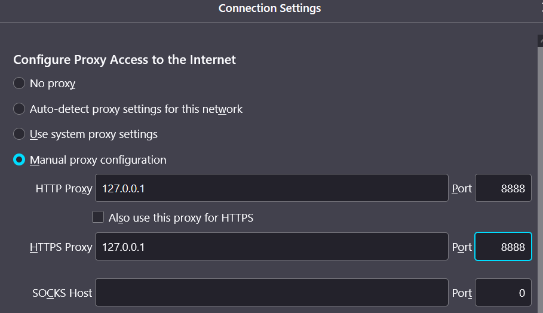
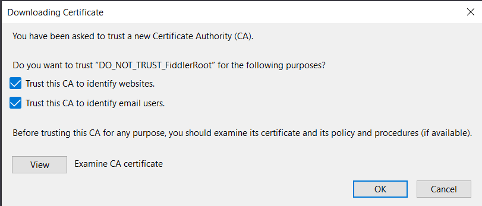

# Capture HTTPS traffic from Firefox

## Configure Fiddler Classic 

1. Click **Tools > Options**. 

2. Click the **HTTPS** tab. Ensure the **Decrypt HTTPS traffic** checkbox is checked. 

3. Click the **Export Fiddler Root Certificate to Desktop** button.

  

## Configure Firefox

- Open **Firefox > Settings > Network Settings**, choose **Manual Proxy Configuration** and enter the Fiddler proxy address as HTTP and HTTP(S) proxy.

  

  >tip Note that newer Firefox versions already respect the system proxy by default (**Use system proxy settings** is selected by default). Use the manual configuration only if you need to capture Firefox traffic only and you would like to avoid polluting the captured sessions with system traffic.

- Trust the Fiddler Root Certificate

  - Option 1. Instruct Firefox to trust added CA (Windows only).

    1. Open Firefox and type `about:config` 

    1. Toggle the `security.enterprise_roots.enabled` setting to `true`.

  - Option 2. Add the Fiddler root certificate in the Firefox certificate manager.

    1. Open Firefox and type `about:preferences

    1. Type `certificates` in the search box and open **View Certificates**. The Firefox certificate manager opens.

    1. Import the Fiddler Root Certificate as a certificate authority in the **Authorities**  tab.

    1. Fully trust the Fiddler CA.

      

