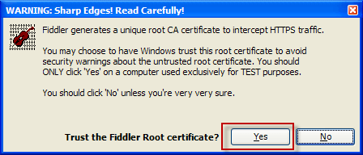
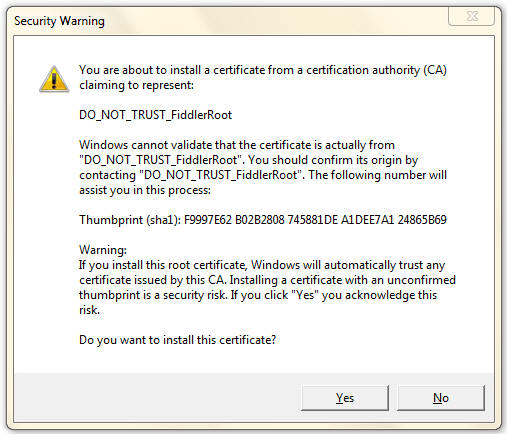

# Configure Windows Client App to trust Fiddler Root Certificate

1. [Enable HTTPS traffic decryption](slug://DecryptHTTPS).
1. Next to **Trust the Fiddler Root certificate?**, click **Yes**.
    
1. After **Do you want to install this certificate?**, click **Yes**.
    
