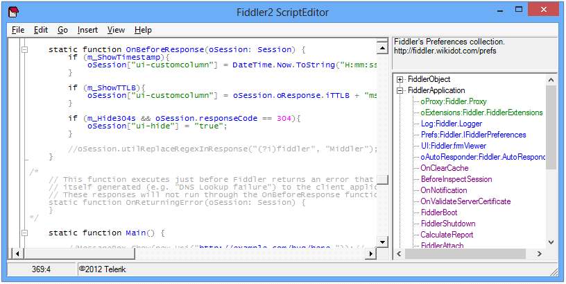

<!-- http://fiddler2.com/fiddler/fse.asp -->

#FiddlerScript Editor

##What is it?
The FiddlerScript Editor is a text editor that helps you edit script rules for Fiddler.  It offers syntax highlighting and a class explorer to help you author scripts.

##Download
FiddlerScript Editor and other syntax-highlighting addons, in [one installer (526 kb)](http://fiddler2.com/redir/?id=SYNTAXVIEWINSTALL). *Last update 6/7/2012*

##Screenshot

 