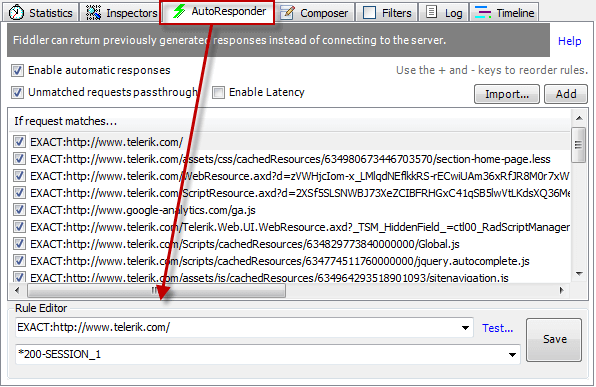

# Create Traffic with Custom Matching Rules

## Enable Autoresponder

In the **Autoresponder** tab, check **Enable automatic responses**.
 

## Compose Autoresponder Rules

At the bottom of the **Autoresponder** tab, under the **Rule Editor**:
1. Type a **match rule** in the top field.
2. Type an **action string** in the bottom field.
  

When **Enable automatic responses** is checked, Fiddler Classic undertakes the action if a captured request URI matches the match rule.

