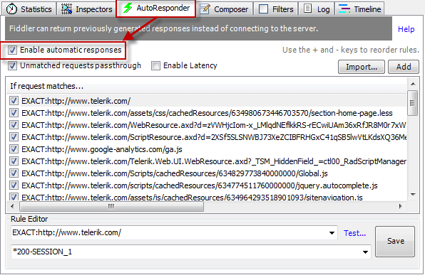
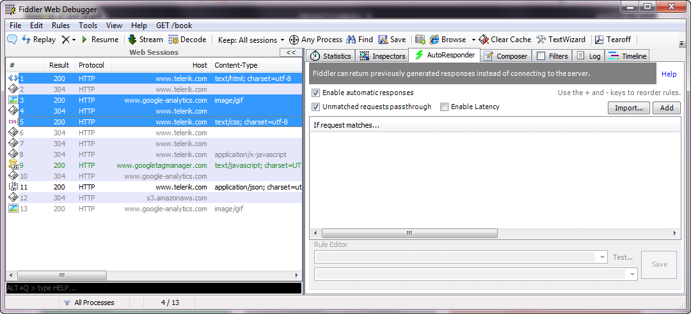
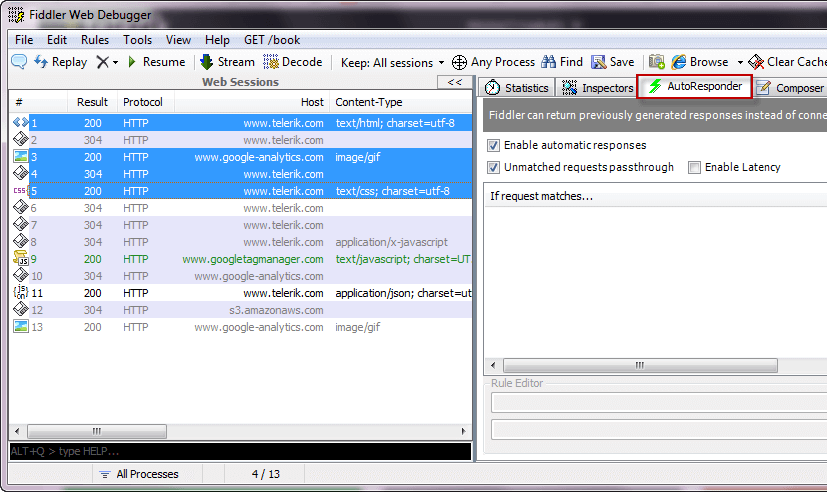
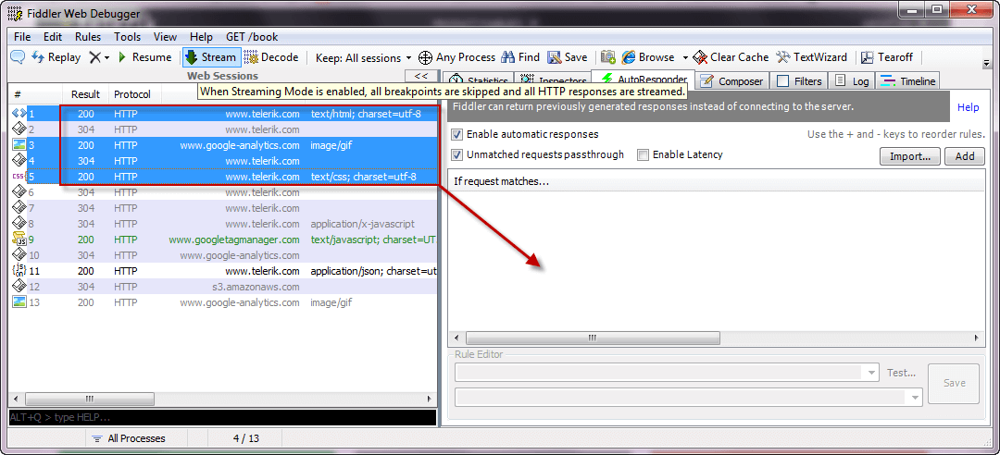

# Replay Captured Traffic

## Enable Autoresponder

In the **Autoresponder** tab, check **Enable automatic responses**.

 

## Create matching rules from the Web Sessions List

To replay captured responses to matching requests instead of transmitting the request to the destination server:

1. Select sessions in the **Web Sessions List**. Press `Ctrl+Click` to select multiple sessions.

 

2. Click the **Autoresponder** tab to the right.

 

3. Click and drag the selected web sessions from the **Web Sessions List** to the rules list in the **Autoresponder tab**.

 

The rules list now populates with rules that respond to the captured requests with the corresponding captured responses.