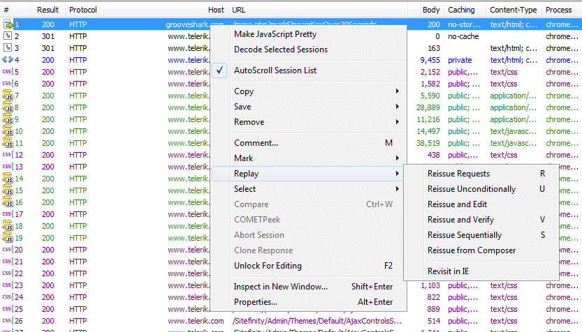
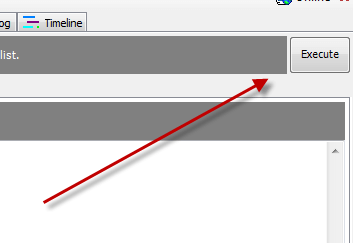

# Resend a Request

You can resend a request directly from the **Sessions List**, or save requests to resend in the **Composer**.

## Resend a Request from the Sessions List

1. Select one or more sessions in the Sessions List.
2. Press **R** or right-click the session(s) and click **Replay > Reissue Requests**.
   

## Resend a Session from the Composer

1. Click the **Composer** tab.
2. In the Composer tab, click the **Scratchpad** tab.
3. Click and drag one or more sessions from the Sessions List.
   
4. Triple-click the content of a session in the Scratchpad to select the entire session contents.
   
5. Click **Execute** to reissue the request(s).
   