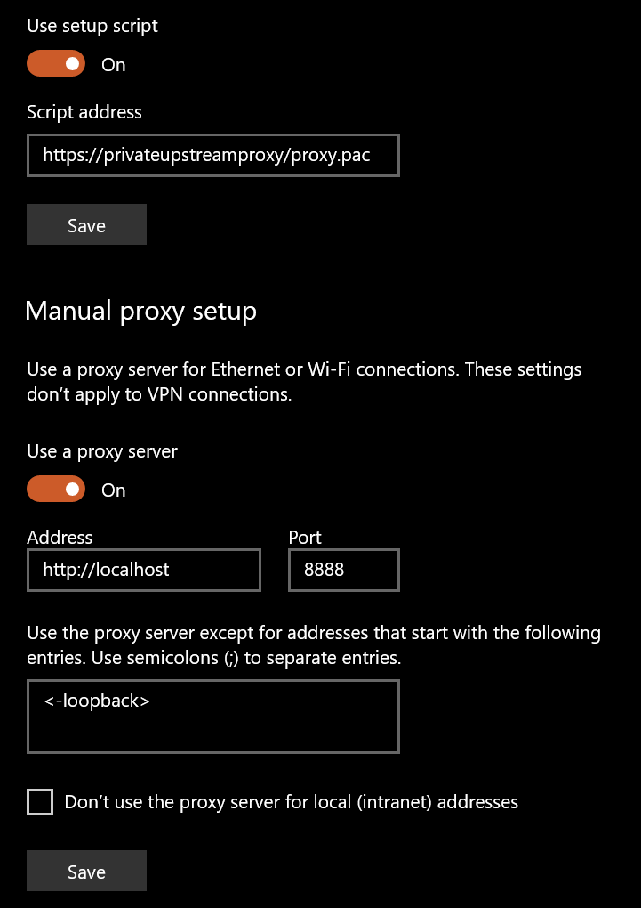

## Environment
<table>
	<tbody>
		<tr>
			<td>Product Version</td>
			<td>5.0.20194.41348 </td>
		</tr>
		<tr>
			<td>Product</td>
			<td>Progress® Telerik® Fiddler™ </td>
		</tr>
	</tbody>
</table>


## Description
In some cases, when using Fiddler it may be necessary to allow traffic through to an upstream proxy. If this is needed, follow the below solution.

## Solution

1. Configure the OS Auto Proxy settings with a PAC file and with Fiddler's Proxy configuration.

    

2. Use a catch in the PAC file. 

    ```JavaScript
    function FindProxyForURL(url,host){

        // Catch specific URL
        if (shExpMatch(url,"xxxxxxxxxxxxxxxxxxxxxxxxxxxxxxxx")){
            return "PROXY xxxxxxxxxxxxxx";
        }

        // Let other URLs use fiddler
        return "PROXY localhost:8888";
    }
    ```

3. Start Fiddler with -noattach flag.

    ```CMD
    fiddler.exe -noattach
    ```

4. Set Fiddler Gateway Options to No Proxy to prevent infinite loop.

    