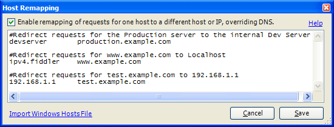

## Environment

<table>
	<tbody>
		<tr>
			<td>Product Version</td>
			<td>5.0.20253</td>
		</tr>
		<tr>
			<td>Product</td>
			<td>Progress® Telerik® Fiddler Classic </td>
		</tr>
	</tbody>
</table>

## Overriding HOSTS

The **HOSTS...** command on the **Tools** menu allows you to easily retarget requests from one host to another.

How does it work?
-----------------

In the box, enter a list of overrides, one per line. The new hostname or IP address should be placed in the first column, followed by the corresponding original host name to override. The override and original hostname should be separated by at least one whitespace character.



Any line may be preceded by a **#** sign to indicate that the line contains a comment.

You may import the Windows **Hosts** file (%SYSTEMROOT%\System32\drivers\etc\hosts) using the link at the bottom of the dialog.

Unlike the Windows HOSTS file, you don't need to specify the IP address of the new target; you can specify a hostname instead. You can also specify a port, so the following rule:

```txt
127.0.0.1:8088    meddler
```

will send all requests for **http://meddler/** to **http://127.0.0.1:8088**.