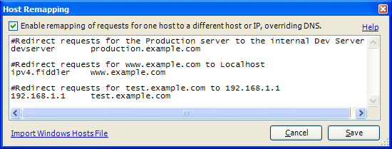

## Environment

<table>
	<tbody>
		<tr>
			<td>Product Version</td>
			<td>5.0.20253</td>
		</tr>
		<tr>
			<td>Product</td>
			<td>Progress® Telerik® Fiddler Classic </td>
		</tr>
	</tbody>
</table>

## Overriding HOSTS

The **HOSTS...** command on the **Tools** menu allows you to easily retarget requests from one host to another.

## How Does It Work?

In the box, enter a list of overrides, one per line. Place the new hostname or IP address in the first column, followed by the corresponding original host name to override. Separate the override and original hostname by at least one whitespace character.



Any line may be preceded by a `#` sign to indicate that the line contains a comment.

You may import the Windows `Hosts` file (`%SYSTEMROOT%\System32\drivers\etc\hosts`) using the link at the bottom of the dialog.

Unlike the Windows HOSTS file, you do not need to specify the IP address of the new target; you can specify a hostname instead. You can also specify a port, so the following rule:

```txt
127.0.0.1:8088    meddler
```

sends all requests for `http://meddler/` to `http://127.0.0.1:8088`.