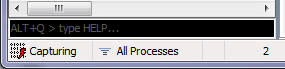

User Interface Guide
====================

Overview
--------

The Web Sessions List
---------------------

The Web Sessions list contains the list of HTTP Requests that are sent by your computer.  You can resize and reorder the columns in this list for your convenience.  You can also sort this list by clicking on the column header.

Certain key information is available in this list, including:

+ # - An ID# of the request generated by Fiddler Classic for your convenience
+ Result - The Result code from the HTTP Response.  
+ Protocol - The Protocol (HTTP/HTTPS/FTP) used by this session
+ Host - The hostname of the server to which the request was sent
+ URL - The path and file requested from the server
+ Body - The number of bytes in the Response body
+ Caching - Values from the Response's Expires or Cache-Control headers
+ Process - The local Windows Process from which the traffic originated
+ Content-Type - The Content-Type header from the Response
+ Custom - A text field you can set [via scripting](slug://slug AddColumns).
+ Comments - A text field you can set from scripting or the session's context menu

In Fiddler Classic v2.2.0.5 and later, you can add new columns of your choice.

The default text coloring of the Session entries derives from the HTTP Status (red for errors, yellow for authentication demands), traffic type (CONNECT appears in grey), or response type (CSS in purple, HTML in blue; script in green, images in grey).  You can override a session's text color using the ui-color flag in FiddlerScript.

Each session is marked with an icon for quick reference:

+  	Request is being sent to the server
+  Response is being read from the server
+  Request is paused at a breakpoint
+  Response is paused at a breakpoint
+  Request used HTTP HEAD method; response should have no body
+  Request used HTTP POST method
+  Request used HTTP CONNECT method; this establishes a tunnel used for [HTTPS traffic](slug://slug DecryptHTTPS)
+  Response was HTML
+  Response was an image
+  Response was a script
+  Response was Cascading Style Sheet
+  Response was XML
+  Response was JSON
+  Response was an audio file
+  Response was a video file
+  Response was a Silverlight applet
+  Response was a Flash applet
+  Response was a font
+  Generic successful response
+  Response was HTTP/300,301,302,303 or 307 redirect
+  Response was HTTP/304: Use cached version
+  Response was a request for client credentials
+  Response was a server error
+  Session was aborted by the client, Fiddler, or the Server.

Interacting with Sessions
-------------------------

If you right-click one or more sessions, a context-menu appears:

Tip: You can add to this menu using the [ContextAction feature of FiddlerScript](slug://slug PerfTesting).  

On the **Copy** menu:

+ Session - Copy the raw session(s) to the clipboard in plaintext and colorized HTML format
+ Just URL - Copy the hostname + URL path
+ Headers Only - Copy the request and response headers to the clipboard in plaintext and colorized HTML format
+ Full Summary - Copy all columns in the session list to the clipboard in plaintext and HTML suitable for pasting into Excel
+ Terse Summary - Copy the request URL and the response Status to the clipboard

On the **Save** menu:

+ **Session > In ArchiveZIP** - Creates a .SAZ archive containing all selected requests & responses, plus an index page. 
+ **Session** - Create a text file containing the request followed by the response
+ **Headers Only** - Create a text file containing the request and response headers
+ **Full Request** - Create a text file containing the request headers and request body
+ **Request Body** - Create a file containing the body of the request (generally HTTP POST data)
+ **Full Response** - Create a text file containing the response headers and response body
+ **Response Body** - Create a file contain the body of the response (often HTML or an image)

AutoResponder
-------------

The [AutoResponder tab][34] allows you to return locally stored content instead of forwarding requests to the server.  Learn more...

Inspectors
----------

The Inspectors tab allows you to view the contents of each request and response, in a variety of different formats.  You can develop custom Inspectors using .NET.

Filters
-------

The Filters tab enables you to quickly filter out traffic that is not of interest. 

Timeline
--------

The Timeline Tab shows the transfer timeline of selected HTTP Sessions.

QuickExec
---------

The QuickExec box below the session list allows you to execute commands and search your traffic. Learn more...

Request Composer
----------------

The [Request Composer](slug://slug CreateNewRequest) allows you to craft custom requests to send to the server.  You can either create a new request manually, or you can drag and drop a session from the Web Sessions list to create a new request based on the existing request. Learn more...

