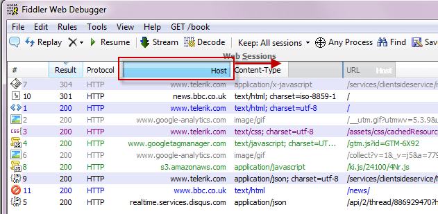

# Configure Columns

## Rearrange Columns

* To reorder the columns, drag a column header to the left or the right. 
 
* To resize a column, drag the edge of a column header.
 

## Add Custom Columns

Use on of these methods:

* Use the **Customize Columns** menu.
    1. Right-click the top of a column and select **Customize Columns...**.
    
    2. Click the **Collection** drop-down menu and select the collection that will populate the column.
    
    3. Enter the name of the collection member that will populate the column and the title of the column.
* **Use QuickExec to add a temporary column**
    ```txt
    cols add [Title] FlagName 
    ```
  ![QuickExec Command][./images/QuickExecCommand.png]
Columns added using QuickExec will be removed the next time Fiddler Classic starts. For more QuickExec column commands, see the [QuickExec Reference](slug://QuickExec).
* [Customize rules with FiddlerScript](slug://AddColumns)
* **Call the AddBoundColumn method from an IFiddlerExtension**
    Call the **AddBoundColumn** method from an [IFiddlerExtension], passing a **getColumnStringDelegate** as the third parameter.