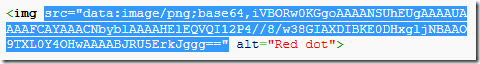
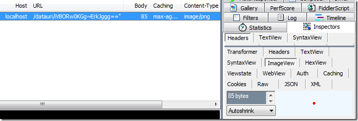

# Inspect DataURI Object

To inspect a DataURI object:

1. Copy a [DataURI](https://en.wikipedia.org/wiki/Data_URI_scheme) to your clipboard from Fiddler Classic or any other source.
    
2. Click **Edit > Paste Files as Sessions**. Fiddler Classic will parse the DataURI and create a new Session for it in the **Web Sessions List**.
    
3. [Use Fiddler Classic inspectors](slug://ViewSessionContent) to examine the resulting object.
    
