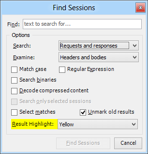

# Search and Filter Sessions

To search through captured requests and responses:

+ Click **Edit > Find Sessions...** and specify search options in the dialog.
    
+ Enter a [command](slug://QuickExec) in the QuickExec box.
