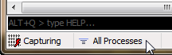
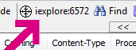
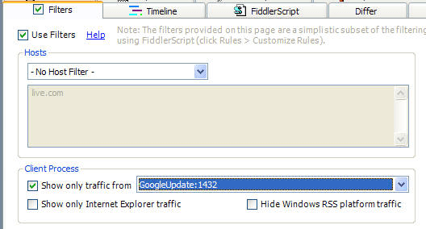

# Problem: Specific Traffic is Missing

I see some traffic in the Web Sessions List, but some traffic (for example, from a specific program) seems to be missing.

## Solution: Check for Traffic Filters

Check to see if any Traffic Filters are enabled.  

+ Check in the **status bar**

  

+ Check the **Process Filter** in the toolbar.

  

+ Check the **Filters tab**. 

+ If you've written or set any [Fiddler Classic Rules](slug://AddRules) check those too.

+ Click **Help** > **Troubleshoot Filters...**. When you do so, traffic that would otherwise be hidden is instead shown in a strikethrough font. The **Comments** column shows which of Fiddler's filters was responsible for attempting to hide the traffic.
