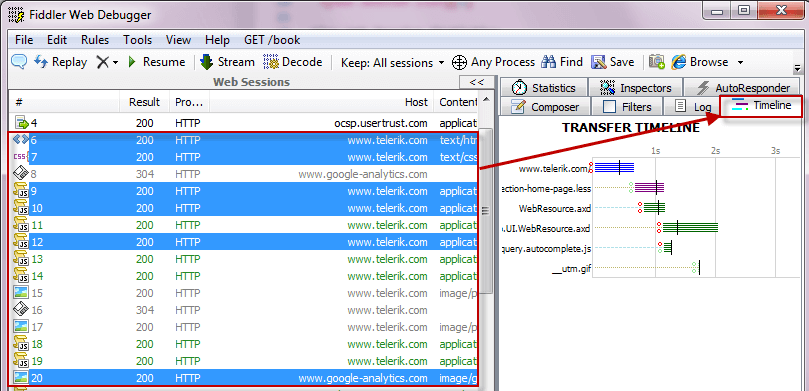

# Visualize Sessions Transfer Timeline

To view a waterfall diagram of the transfer timeline for one or more web sessions:

1. Select one or more web sessions in the **Web Sessions List**. Hold down the **CTRL** key and click to select more than one session.
2. Click the **Timeline** tab.
    