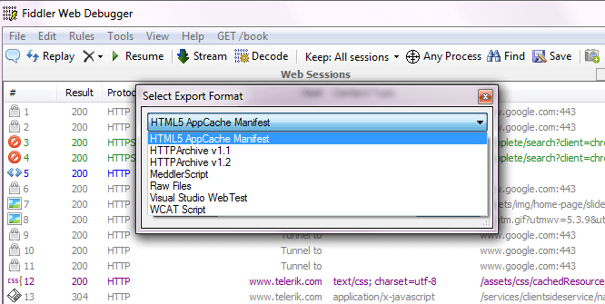
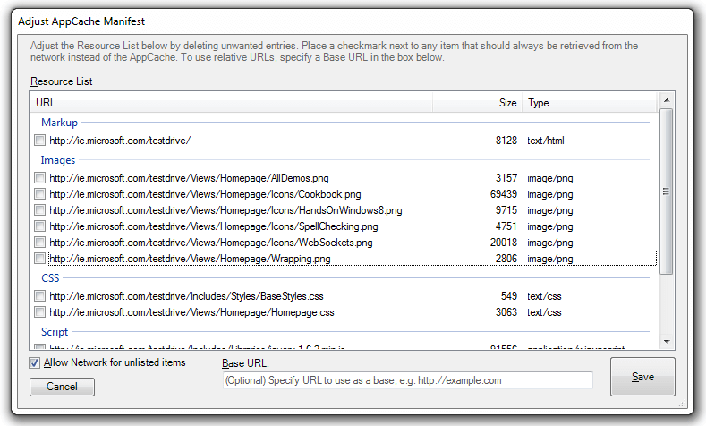

# Export to Default Formats

To export traffic to **WCAT Script**, **VS Web Test Script**, [**Meddler Script**](http://www.webdbg.com/meddler/), **HTML5 AppCache Manifest**, **HTTP Archive Format 1.1**, **HTTP Archive Format 1.2**
), or a **Raw File Dump**:

1. Click **File > Export Sessions**.

2. Click either **All Sessions** or **Selected Sessions**.

3. Select the export format from the drop-down menu.

 

4. Click **Next** to select the export file location.
 
5. If exporting to **HTML5 AppCache Manifest**: Check any resources you wish to exclude from the CACHE section of the Manifest. These will be added to the NETWORK section of the Manifest.

 

6. To specify a **Base URL** and convert the URLs to be relative to this URL, type this URL in the **Base URL:** field.

 

7. Click **Save**. The AppCache Manifest appears in a text editor.

## Import to Default Formats

To import traffic from **HTTP Archive JSON**, **HTTP Archive XML** (exported from [IE9 Developer Tools Network Tab][12]), or **Test Studio Load Test**:

1. Click **File > Import Sessions...**.

2. Select the import format from the drop-down menu.

 ![Select Import Format][./images/SelectImportFormat.png]

3. Click **Next**.

## Create Custom Importers and Exporters

[Create Custom Importers and Exporters](slug://BuildImporterExporter) with Fiddler Classic Extensions.
