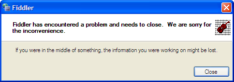

# Fiddler Classic Crashes on Startup with an unhelpful message box

If you see this message box when starting Fiddler:

  

...it generally means that your .NET Framework installation is corrupt.  If you uninstall and reinstall the .NET 2.0 Framework, the problem is usually resolved.