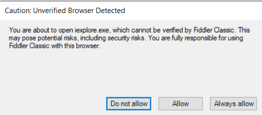

# Security Warnings and Consent Dialogs in Fiddler Classic

The Fiddler Classic application loads a list of add-ons and extensions on startup or upon user actions (for example, open diff tool in inspectors). Additionally, users can download or create extensions or change the default tools' settings. To guarantee that harmless third-party tools are not loaded, the application automatically checks them, informs the user, and asks for consent to operate. The security dialog has three applicable options as follows:

**Do not allow**: The action will be terminated immediately when chosen. The consent dialog will re-appear upon consecutive interactions of the same type.

**Allow**: When chosen, the action is executed immediately. The consent dialog will appear upon consecutive interactions of the same type.

**Always Allow**: When chosen, the action is executed immediately. The consent dialog will not appear in the future.

The consent dialogs in Fiddler Classic are triggered upon the following actions or user interactions:

- During application startup, when the application loads unknown plugins.
- During application startup, when the application loads unknown inspectors.
- During application startup, when the application loads unknown transcoders.
- During application startup, when the application loads unknown extensions.
- When the user clicks on a menu item that was created.
- When the user tries to select an app to open a file (session response, autoresponder rule response).
- When the user tries to edit an autoresponder rule response with the default editor for that file type.
- When the user tries to compare two sessions with the configured external compare tool in the app settings.
- When the user tries to edit the FiddlerScript rules with the configured external editor (when different from our FSE), it is also set in app settings.
- When the user chooses to save a session response and open the file directly (or start it if it is executable).
- When the user executes a custom context menu action from the image response inspector.
- When the user tries to open an image with an external editor from the image response inspector.
- When the user sets a custom tool for some Fiddler functionality such as, such as custom makecert.exe or brotli.exe,
- When the user chooses to open a session url with a specific browser (browsers are detected using heuristics, so it is not sure that they are installed).
- During capturing, if the user has specified a custom certificate maker assembly.

